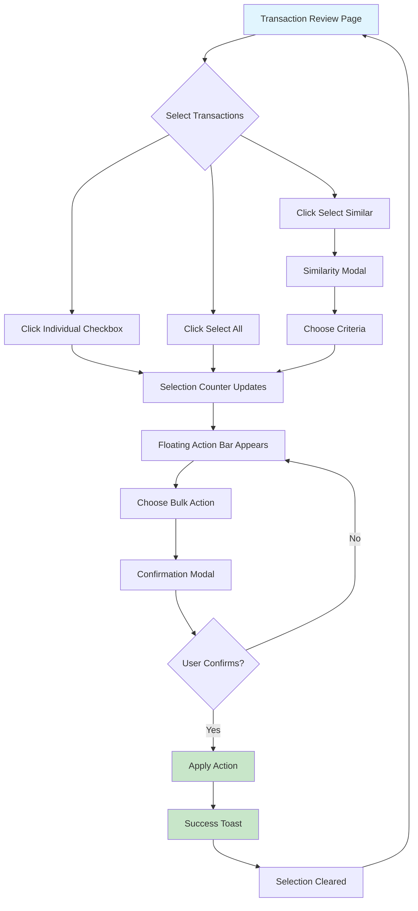
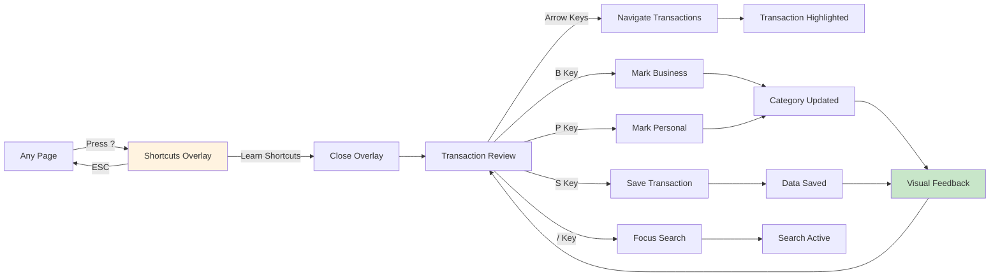
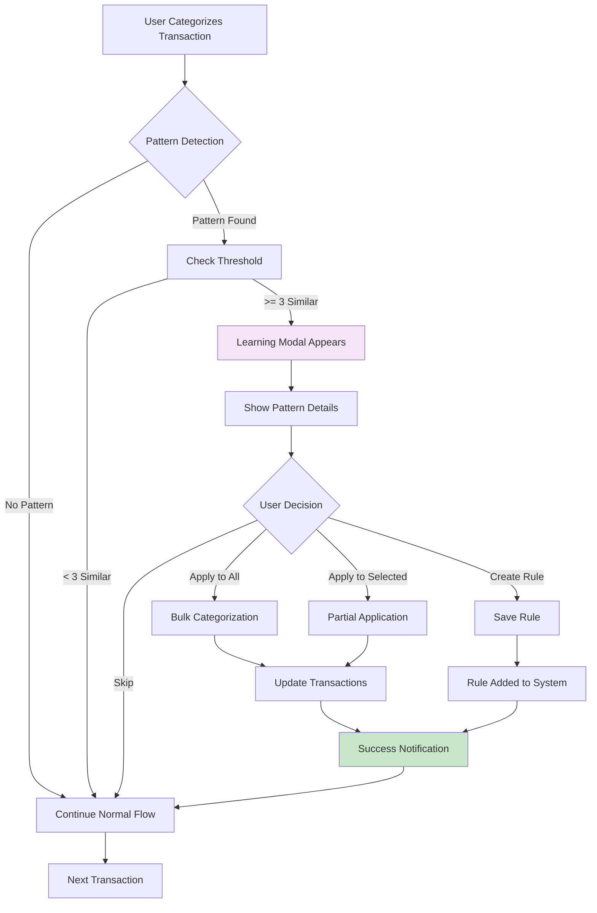
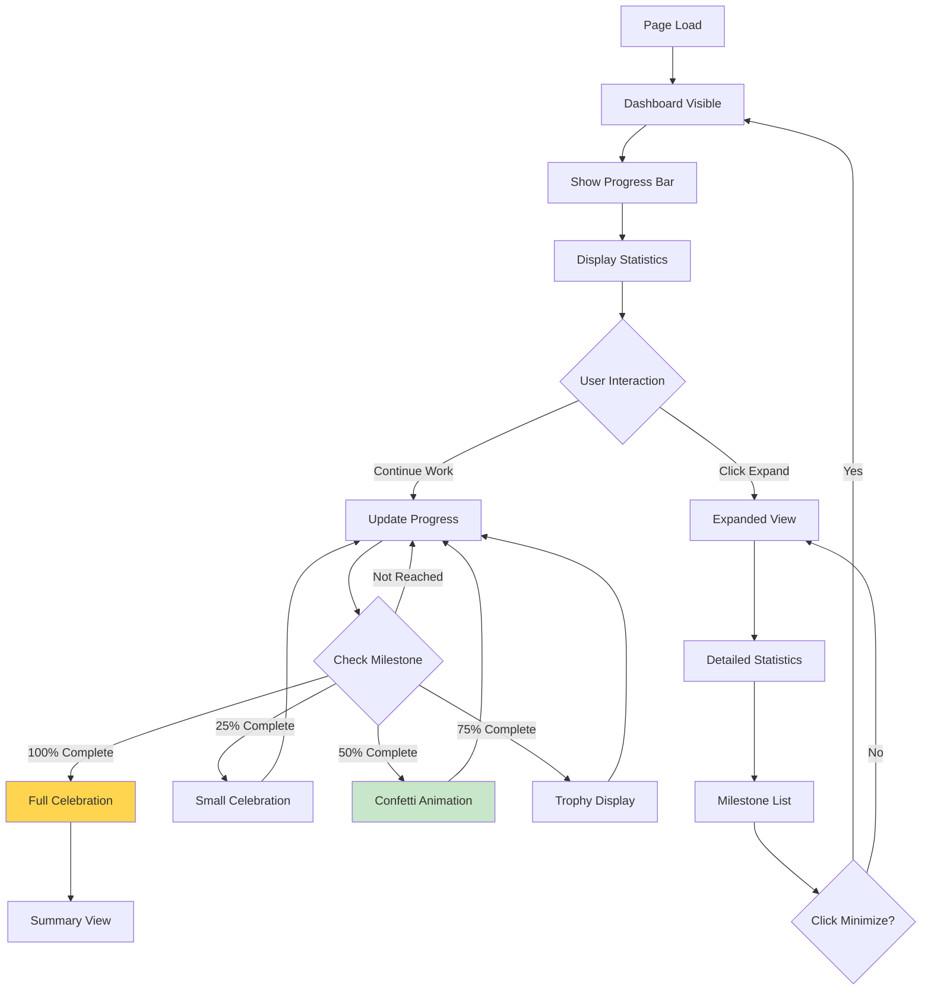
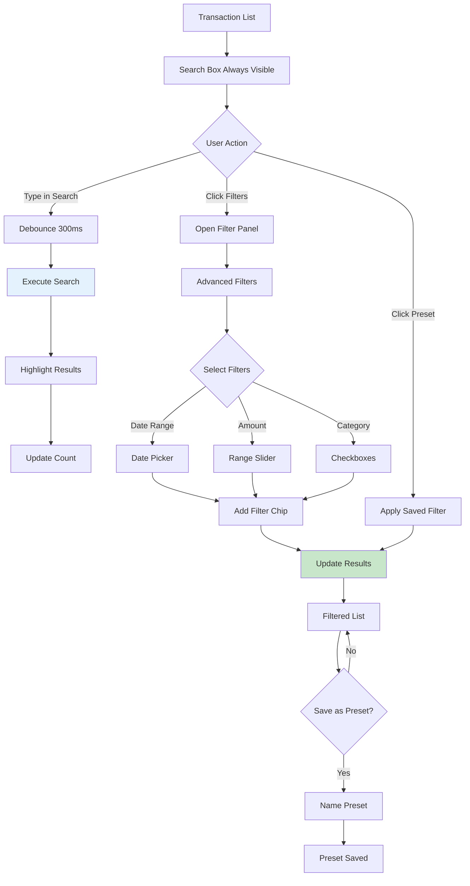
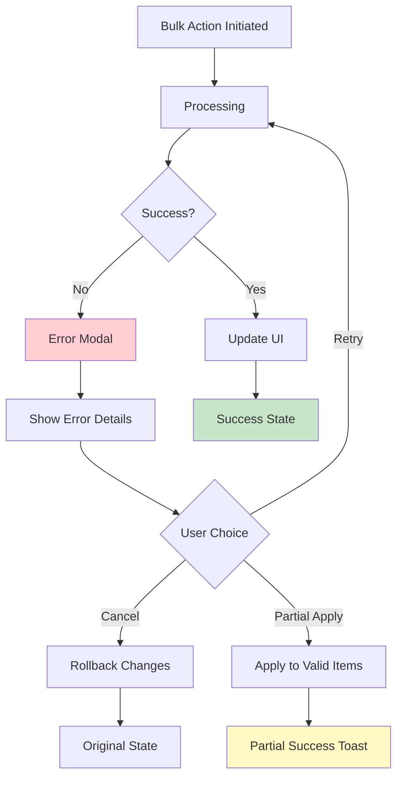
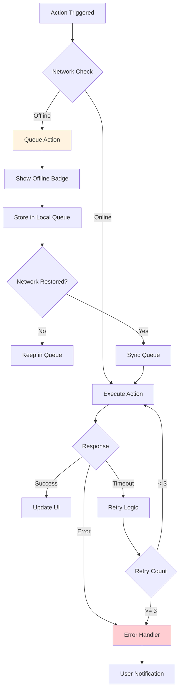
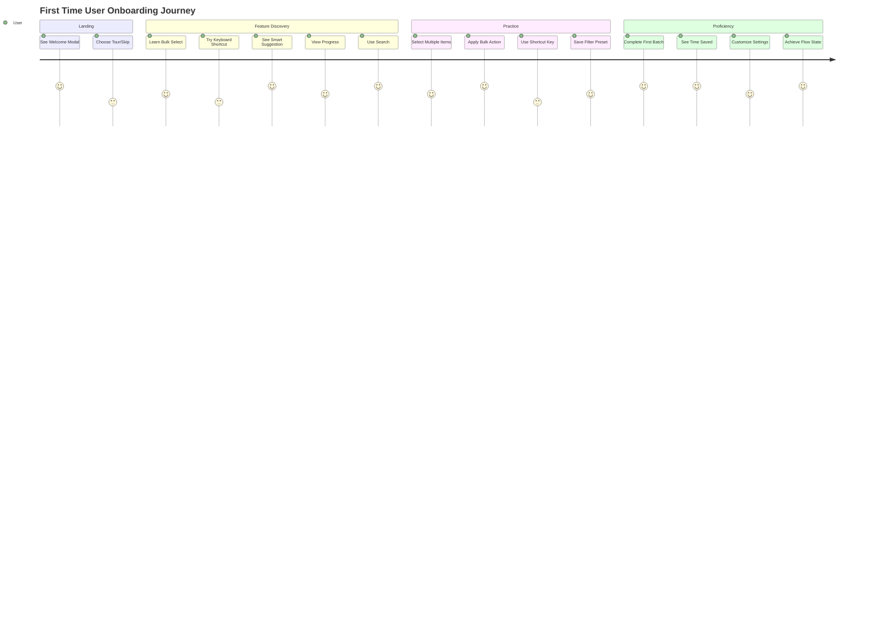

# User Flow Diagrams - UK Tax Helper

## Visual Flow Representations

### 1. Bulk Operations Flow



### 2. Keyboard Navigation Flow



### 3. Smart Learning Flow



### 4. Progress Dashboard Interaction



### 5. Search and Filter Flow



## Interaction State Diagrams

### Transaction Selection States

```
States:
┌─────────────┐     Select      ┌─────────────┐
│   Default   │ ─────────────> │  Selected   │
│ (Unchecked) │                │  (Checked)  │
└─────────────┘ <───────────── └─────────────┘
                   Deselect
       │                              │
       │ Hover                        │ Hover
       ▼                              ▼
┌─────────────┐                ┌─────────────┐
│   Hovered   │                │ Hover+Check │
│  (Outline)  │                │ (Highlight) │
└─────────────┘                └─────────────┘
```

### Modal Lifecycle

```
Trigger → Opening (Animation) → Open → User Interaction
                                  │
                                  ├─→ Confirm → Processing → Success → Closing
                                  │
                                  └─→ Cancel → Closing → Closed
```

### Filter Application Sequence

```
1. User Input
   └─> Validation
       └─> Processing Indicator
           └─> Apply Filter
               └─> Update URL State
                   └─> Fetch Filtered Data
                       └─> Update UI
                           └─> Show Results Count
                               └─> Ready for Next Action
```

## Error Recovery Flows

### Failed Bulk Operation



### Network Failure Handling



## Mobile Gesture Flows

### Swipe Actions

```
Right Swipe (>50px):
Start ──→ Swipe ──→ Threshold ──→ Visual Feedback ──→ Select Item

Left Swipe (>50px):
Start ──→ Swipe ──→ Threshold ──→ Visual Feedback ──→ Deselect Item

Long Press (>500ms):
Touch ──→ Hold ──→ Haptic ──→ Context Menu ──→ Choose Action

Pull to Refresh:
Pull Down ──→ Loading Indicator ──→ Fetch Data ──→ Update List ──→ Hide Indicator
```

## Onboarding Journey Map



## State Machine Definitions

### Bulk Selection State Machine

```typescript
const bulkSelectionMachine = {
  initial: 'idle',
  states: {
    idle: {
      on: {
        SELECT_ITEM: 'selecting',
        SELECT_ALL: 'allSelected'
      }
    },
    selecting: {
      on: {
        SELECT_MORE: 'selecting',
        DESELECT_ITEM: 'selecting',
        CLEAR_ALL: 'idle',
        APPLY_ACTION: 'processing'
      }
    },
    allSelected: {
      on: {
        DESELECT_ITEM: 'selecting',
        CLEAR_ALL: 'idle',
        APPLY_ACTION: 'processing'
      }
    },
    processing: {
      on: {
        SUCCESS: 'complete',
        ERROR: 'error'
      }
    },
    complete: {
      on: {
        RESET: 'idle'
      }
    },
    error: {
      on: {
        RETRY: 'processing',
        CANCEL: 'selecting'
      }
    }
  }
};
```

### Search State Machine

```typescript
const searchStateMachine = {
  initial: 'idle',
  states: {
    idle: {
      on: {
        TYPE: 'debouncing'
      }
    },
    debouncing: {
      after: {
        300: 'searching'
      },
      on: {
        TYPE: 'debouncing',
        CLEAR: 'idle'
      }
    },
    searching: {
      on: {
        SUCCESS: 'results',
        ERROR: 'error',
        TYPE: 'debouncing'
      }
    },
    results: {
      on: {
        TYPE: 'debouncing',
        CLEAR: 'idle',
        FILTER: 'filtering'
      }
    },
    filtering: {
      on: {
        APPLY: 'searching',
        CANCEL: 'results'
      }
    },
    error: {
      on: {
        RETRY: 'searching',
        CLEAR: 'idle'
      }
    }
  }
};
```

---

END OF FLOW DIAGRAMS